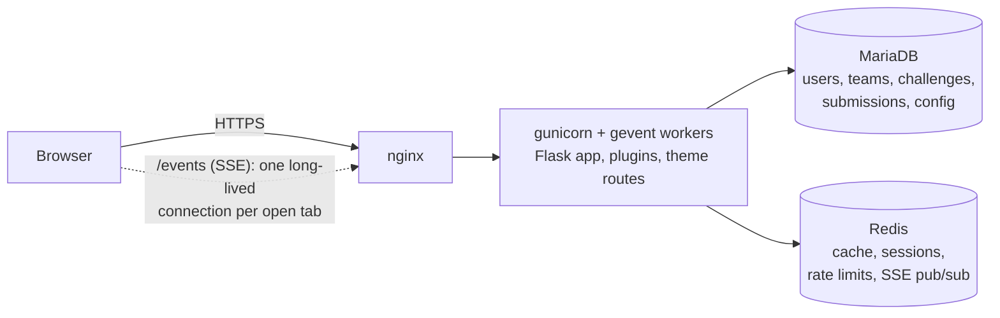

# CTFd 3.8.x: how it works and where it strains

Source-level review of upstream **CTFd 3.8.8** (released 2026-10-02, Apache-2.0). Items marked **verified** were confirmed by reading the code at the cited path and line. Items marked **hypothesis** are inferences that the load test in Task 4 must confirm or kill. No benchmark has been run yet.

## 1. Snapshot

| | |
|---|---|
| Stack | Python 3.11, Flask 2.1.3, SQLAlchemy 1.4, Flask-RESTX, marshmallow 2.x |
| Process model | gunicorn with gevent workers (`docker-entrypoint.sh`) |
| State | MariaDB/MySQL (SQLite for dev). Redis for cache, sessions, rate-limit counters and SSE pub/sub |
| Player UI | `core` theme: Vite, Alpine.js, Bootstrap 5.3, Vue 3, ECharts (about 2k lines of its own JS/Vue) |
| Admin UI | `admin` theme: Vue 3, about 13k lines, separate from the player theme |
| Server code | about 5.5k lines in `api/`, 4.7k in `utils/`, 0.9k in `models/` |
| Tests | 100 pytest files upstream |
| License | Apache-2.0 (Section 6 grants no trademark rights). The default footer links "Powered by CTFd" |

Before-request hooks run in this order on every request (`CTFd/utils/initialization/__init__.py`): setup check, `tracker`, `banned`, `change_password`, `tokens`, `csrf`. Everything else is a plugin or a route.

## 2. The flag-submission path (the hot path)

`POST /api/v1/challenges/attempt`, `CTFd/api/v1/challenges.py:646`.

1. Decorators check challenge visibility, the event window and verified email (`:648-650`).
2. The challenge is loaded. Hidden returns 404, locked returns 403 (`:705-709`).
3. Prerequisites: the account's solve IDs and all challenge IDs are queried, and the request is refused unless every prerequisite is solved (`:711-728`).
4. Wrong submissions in the last minute are counted against `incorrect_submissions_per_min`, default 10 (`:733-737`).
5. If the challenge has `max_attempts`, a Redis `SETNX` lock per account and challenge is taken (`:753-773`), then an atomic `INCR` counter is bumped (`:777-781`).
6. The challenge type's `attempt()` runs. On a correct flag, `solve()` writes the `Solves` row. Dynamic challenges then recompute their value and commit (`plugins/dynamic_challenges/__init__.py:143-146`).
7. `clear_standings()` and `clear_challenges()` are called (around `challenges.py:913-956`).
8. Because this is a POST, the `tracker` hook has already upserted a `Tracking` row for the IP and committed (`utils/initialization/__init__.py:242-282`).

## 3. What to keep

- A mature domain model: user and team modes, brackets, hints with costs, awards, dynamic scoring (linear and logarithmic decay), freeze time, per-challenge attempt limits, static and regex flags, local or S3 files, pages, notifications, custom registration fields, API tokens, import/export, ratings, comments and official solutions.
- Real extension points: challenge types, flag types, blueprints, asset directories, admin menu entries and runtime-selectable themes. New behaviour can live in `plugins/` and `themes/` with no edit to core.
- A REST API plus `ctfcli`, so challenge authors can manage challenges as code (`challenge.yml`).
- A 100-file test suite we can run against our own changes.
- A permissive license.

## 4. Where it strains

| ID | Finding | Evidence | Why it matters here | Status |
|----|---------|----------|---------------------|--------|
| S1 | **Single-worker defaults.** `WORKERS` defaults to 1. More than one requires `SECRET_KEY`. | `docker-entrypoint.sh:4,12-20`; `docker-compose.yml:11` | One Python process does all CPU work (JSON, ORM, bcrypt). gevent only overlaps I/O waits. Last year's production ran this default | verified |
| S2 | **DB pool arithmetic.** SQLAlchemy's default pool of 5 plus `max_overflow=20` gives 25 connections per worker. MariaDB's default cap is 151 | `CTFd/config.py:276-280` | Adding workers without tuning MariaDB swaps slow requests for "too many connections" | pool verified; failure point hypothesis |
| S3 | **Standings cache is cleared constantly.** Memoized for 60 s, but cleared on every solve, award and many admin actions | `utils/scores/__init__.py:10`; `cache/__init__.py:133-178`; `challenges.py:913-956` | In solve bursts the cache is effectively cold. Each scoreboard hit pays for an aggregate over all solves and several workers may recompute at once | invalidation verified; impact hypothesis |
| S4 | **Dynamic scoring writes per solve.** It recomputes and commits the challenge row on every solve | `plugins/dynamic_challenges/__init__.py:90-97,143-146` | Opening-minutes solves of easy challenges serialise on one row, and each triggers invalidation | verified; impact hypothesis |
| S5 | **IP-keyed rate limits.** Login, register and team-join: 10 per 5 s. Email confirm and password reset: 10 per 60 s. SSE: 150 per 60 s. The counter is read-then-write, so not atomic | `utils/decorators/__init__.py:162-192`; `auth.py:39,121,238,443`; `teams.py:127`; `events/__init__.py:12` | Finals on one campus NAT: 40 people logging in together share one 10-per-5-seconds budget. Flag submission is not affected, it is limited per account | verified |
| S6 | **Sessions live in the cache** | `utils/sessions/__init__.py:42-113` | A Redis restart, flush or eviction logs everyone out. Upstream compose uses `redis:4` with no persistence flags | verified |
| S7 | **Realtime is notifications-only.** SSE with one greenlet and queue per open tab and 5-second pings. Only admin notifications publish. No replay after reconnect | `utils/events/__init__.py:53-66`; `api/v1/notifications.py:151` | No event exists for solves, first blood or story progress. A story overlay and live meters need our own event stream | verified |
| S8 | **Theme assets are served by Flask**, and upstream nginx proxies everything to the app | `views.py:484`; `conf/nginx/http.conf` | Every CSS, JS and image request occupies a Python worker unless nginx serves `/themes/` directly | verified |
| S9 | **Dependency debt.** Pins include Flask 2.1.3, Werkzeug 2.2.3, marshmallow 2.20.2, pydantic 1.6.2, Flask-Script 2.0.6, Flask-Migrate 2.5.3. `pip-audit` on 2026-10-03 reports 73 advisories in 10 of 66 pinned packages: Pillow 25, Werkzeug 14, cryptography 13, urllib3 8, Flask 4, seven others between them | `requirements.txt` | Not every advisory is exploitable here. Pillow, cryptography, urllib3, requests, idna, click and python-dotenv can be bumped now. Flask, Werkzeug and pydantic are held back by marshmallow 2 and Flask-RESTX | verified |
| S10 | **No per-team instances, dynamic flags or cheat detection in core.** There is one flag table, a submissions table and an IP-tracking table | `models/__init__.py` | These are the three things last year's team had to build as plugins | verified |
| S11 | **Configuration and content live in the database.** Site config, pages and `theme_header`/`theme_footer` are DB rows. Pages get limited variable substitution, not Jinja | `utils/config/pages.py:11-57`; models `Configs`, `Pages` | Hard to review, diff or roll back. It is how last year's homepage ended up showing literal `{{ }}` tags | verified |
| S12 | **Progression is a flat AND-list** of prerequisite challenges, with TODOs about the schema | `challenges.py:196-204,711-728` | Fine for a few unlocks. We need story nodes, per-team progress and a global meter on top | verified |
| S13 | **No CTFtime feed in core.** The scoreboard API uses CTFd's own format | `api/v1/scoreboard.py` | Required for rating. Small to add (spec: `standings` array, optional `tasks`/`taskStats`, polled every 60 s) | verified |

## 5. Implications for L3m0nCTF

- **Keep CTFd as the engine and extend it by plugin and theme only.** The domain model, API and authoring flow are the expensive parts to rebuild, and the strains above are all addressable around the engine: deployment, caching, an event stream, an instancer and an abuse layer.
- **Do not edit core files.** Last year's fork touched core in two places, and both were noise. Staying clean keeps 3.8.x patch releases mergeable.
- **Treat S3 to S5 as the load-test targets.** Scoreboard recompute, per-solve writes and IP limits are where a 250+ team start will bite first.
- **Replace, don't tune, the realtime and progression parts.** We need our own domain events for the story overlay (S7, S12).
- **Own a dependency policy.** Bump what can be bumped, gate CI on `pip-audit`, and run upstream's tests against every bump (S9).

See [03-options-and-recommendation.md](03-options-and-recommendation.md) for the options considered and the improvement backlog.
