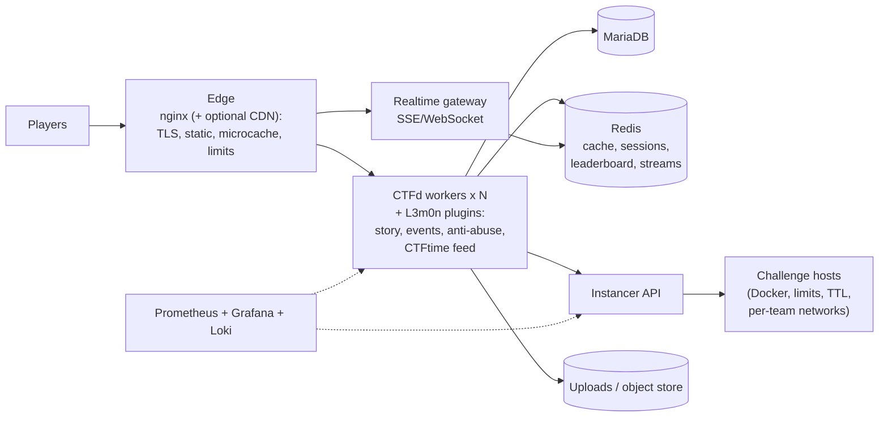

# Platform options and recommendation

Inputs: [01-ctfd-core.md](01-ctfd-core.md) and [02-last-year-fork.md](02-last-year-fork.md). Status: **option A approved on 2026-10-03.** The instancer sub-decision (section 2) and the remaining items in section 6 are still open.

## 1. Requirements that drive the choice

- Prelims in about six weeks. Online, Jeopardy-style, 24 hours. Finals are Jeopardy-style, hosted online with finalists on campus.
- 250+ teams, 150 to 200 challenges, about 30 authors, listed on CTFtime.
- A look that is not CTFd's, with a story overlay on an open board.
- Per-team instances for web, pwn and Web3 challenges. AI/LLM and hardware/IoT/RF tracks.
- Fixes for last year's four pain points: load, hosting, abuse and look/authoring.

**Proposed engineering targets** (assumptions to validate with the load test, not measurements):

| Target | Value |
|--------|-------|
| Capacity | 1,000 teams, about 4,000 accounts, about 2,500 concurrent browsers (CTFtime-listed events draw this: Pragyan CTF 2026 had 892 teams, see the [CTFtime survey](../research/ctftime-requirements.md)) |
| Start-of-event burst | 2,000 challenge-list loads within 60 s |
| Sustained mixed reads | 250 to 400 requests per second |
| Flag submissions, peak | about 70 per second |
| Latency | p95 under 300 ms and p99 under 1 s for reads |
| Errors | under 0.1% |
| Scoreboard freshness | within 5 s |
| Recovery | RPO 5 min, RTO 15 min |

## 2. Options

| | A. CTFd 3.8.x, extended | B. Headless CTFd + separate SPA | C. Different engine (GZCTF) | D. From scratch |
|---|---|---|---|---|
| Idea | Keep the engine. New theme plus plugins. Hardened deployment | CTFd as API only. Standalone Next/Svelte front end and sidecar services | Adopt GZCTF and re-skin it | Own engine, DB and admin |
| Time to ready | Fastest | Slower, two deployables and cross-origin auth | Fast to install, slow to learn and re-skin | Not feasible in six weeks |
| Look freedom | High. A theme can ship any front-end bundle | Highest | Medium, React UI | Highest |
| Built-in instances, dynamic flags, cheat detection | No, must build or adopt | No | Yes (dynamic containers and flags, flag-sharing detection, first-three-solves bonus) | No |
| Authoring flow | `ctfcli` and `challenge.yml`, already known | Same | Different format, authors must relearn | Must be built |
| Scale evidence | Many large events, with tuning | Same engine | Widely used (1.6k stars, active) | None |
| License | Apache-2.0 | Apache-2.0 | AGPL-3.0, so modifications must be published | Ours |
| Fit with the brief ("based on CTFd") | Exact | Exact | Contradicts it | Contradicts it |
| Main risk | Python tuning and dependency debt | Integration bugs near the finish | New stack and new language for the team | Bugs in scoring and admin |

Others looked at and set aside:
- **rCTF** is minimal and fast, but the main repository is archived and it has no built-in instance support (it is paired with external instancers).
- **Ret2Shell** is Rust, needing Redis/Valkey 8+, Postgres 18+ and NATS. It is capable but heavy to operate and its license is unclear.
- **FBCTF** is archived and unmaintained.

**Recommendation: A.** The model, API and authoring flow are the expensive parts to rebuild. Every strain found in doc 01 sits around the engine rather than inside it. Option B's freedom is mostly available inside A, because a CTFd theme can be a full front-end bundle. A SPA in the theme avoids B's cross-origin and double-deploy problems, and the backend can still be split out later if needed.

**Sub-decision: the instancer.**

| Choice | Pro | Con |
|--------|-----|-----|
| Adopt `ctfd-chall-manager` (Apache-2.0, Pulumi scenarios, mana quotas, unique flags) | Built for this. Used in production at several events | Public beta with breaking changes expected. Aimed at Kubernetes |
| Adopt `ctfd-whale` (MIT, Docker Swarm plus frp, subdomains) | Simple, long-lived, used by large training sites | Older design. Swarm and frp to operate |
| Build a thin instancer on dedicated Docker hosts | Full control. Smallest ops surface. Can reuse ideas from last year's plugin | Most code to write and secure |

Leaning toward a thin instancer on dedicated Docker hosts, because it is simplest to operate in six weeks. The decision depends on your hosting answer (Kubernetes available or not) and on whether last year's authors let us reuse their code.

## 3. Recommended shape (sketch only)

This is a sketch. The detailed design comes after the story and look are approved.

## 4. Improvement backlog

Effort is a rough single-developer estimate in working days and is unverified. Pain points: **L** load/outages, **H** hosting, **C** cheating, **A** look/authoring, **S** story, **O** other.

| # | Item | Pain | Effort | Priority |
|---|------|------|--------|----------|
| B1 | Hardened deployment baseline: compose, nginx (static, microcache, TLS), N workers with `SECRET_KEY`, DB pool and MariaDB tuning, Redis 7 with persistence, health checks, zero-downtime redeploy, off-box backups, a restore drill | L, H | 3 to 4 | P0 |
| B2 | Config as code: theme, pages and settings in git, a seed script, rebuild from an empty DB in minutes | A | 1 to 2 | P0 |
| B3 | Scoreboard and live-data pipeline: incremental Redis leaderboard, snapshots, solve counters | L | 3 | P0 |
| B4 | Load-test harness (k6 or Locust) and the 2x-target gate | L | 3 | P0 |
| B5 | Instancer service: per-team instances, TTL, quotas, resource limits, per-team flags, network isolation, multi-host | H | 8 to 10, or adopt | P0 |
| B6 | Anti-abuse suite: per-account limits, NAT-aware heuristics, email verification and CAPTCHA, disposable-email blocking, flag-sharing detection, evidence store, review queue | C | 5 to 6 | P0 |
| B7 | Author kit: private challenge repo template, `challenge.yml`, Dockerfile templates (web, pwn, jail, Web3, LLM), CI (lint, build, run `solve.py`, flag format, size limits), staging deploy, review checklist | A | 4 to 5 | P0, early |
| B8 | Security review: threat model, test of platform and instancer, secrets handling | C, H | 3 | P0 |
| B9 | Realtime gateway and domain events: solve, first blood, story unlock, global meter, announcements | L, S | 3 to 4 | P1 |
| B10 | Story engine plugin: nodes, tokens, per-team progress, global meter, story-mode toggle, admin editor | S | 6 to 8 | P1, after story approval |
| B11 | Custom theme from the Task 3 design | A | 10+ | P1 |
| B12a | CTFtime live minimal standings feed: a worker writes a static file every 15 s, nginx serves it (plan in [CTFtime OAuth and the live feed](../research/ctftime-oauth-and-live-feed.md)) | O | 1 | P1 |
| B12b | CTFtime final results export in the feed format, plus the public scoreboard page | O | 1 | **P0** |
| B12c | CTFtime capture-log feed and maximal standings (`tasks`, `taskStats`, `lastAccept`), only after CTFtime confirms them | O | 2 | P2 |
| B13 | Observability: Prometheus, Grafana, Loki, alerts to Discord, status page, runbooks | L, H | 3 | P1 |
| B14 | Dependency hygiene: `pip-audit` in CI, safe bumps, upstream tests plus ours, Dependabot | C | 2 | P1 |
| B15 | Finals mode: round gating, finalist import and carry-over, per-round boards, campus-IP allowances | O | 2 to 3 | P1 |
| B16 | Dynamic-score optimisation and first-blood bonus | L | 1 to 2 | P2 |
| B17 | In-character LLM hint buddy (rate-limited, cannot leak flags) | S | 3 | P2, optional |
| B18 | Post-event static archive export | O | 1 | P2 |
| B19 | Public landing page and event info: the official site CTFtime needs before it will list us (name, dates in UTC and IST, format, rules, prizes, registration, scoreboard link, contact, Open Graph tags, schema.org `Event`) | O | 2 to 3 | **P0, critical path** |
| B20 | Team-name policy and CTFtime fields: case-insensitive unique names, a "use your CTFtime name" hint, an optional CTFtime team ID, Unicode handled in the feed | C, O | 1 | P1 |
| B21 | "Login with CTFtime" plugin (OAuth2 Authorization Code, scopes `profile:read team:read`), plus "Link CTFtime" from My Team. Optional, and usable only after the event is approved | O, C | 2 to 3 | P1 |
| B23 | A single stable egress IP for the server (sent to CTFtime for the token-endpoint allow-list) and a mock CTFtime OAuth provider for CI | O | 1 | P1 |
| B22 | CTFtime tasks export after the event, so teams can post writeups | O | 1 | P2 |
| B24 | Site essentials bundle: error and busy slates with a page-versus-API error contract, busy mode (concurrency caps, maintenance flag, waiting room later), account gates, info and legal pages, discovery files (`robots.txt`, `sitemap.xml`, `security.txt`, icons, share cards), announcements and a report-a-problem form, status page, health endpoints, audit log, accessibility and security-header basics (list and tiers in the [build design](../superpowers/specs/2026-10-04-platform-build-design.md)) | A, L, O | 6 | P0 for the A-tier items, P1 for the rest |

**Capacity warning.** P0 alone is roughly 32 to 39 working days and P1 roughly 27 to 33 more, against about 30 working days available. Ways to compress, in order of preference:
1. Adopt rather than build: an existing instancer, an existing CTFtime endpoint, a CDN for edge caching and DDoS protection.
2. Reuse last year's plugin code, with permission.
3. Cut P2 entirely, and split P1 so the theme and story ship first.
4. Parallelise with the challenge authors: B7 first, so they are never waiting on us.

## 5. Risks

| Risk | Mitigation |
|------|------------|
| Timeline: story and look approval gate the theme and story engine | Approve the story quickly. Build P0 in parallel, since it does not depend on either |
| Instancer security: it runs untrusted solver traffic next to infrastructure | Separate hosts, no Docker socket in the web tier, hard limits, egress control, review before the event |
| Dependency debt in Flask, Werkzeug and marshmallow | Bump what is safe, gate on `pip-audit`, keep customisations out of core |
| Campus NAT during the finals | Per-account limits, allow-listed campus range, no IP-only abuse rules |
| Story spoilers leaking from a public repo | Story and challenge material lives in a private repo only |
| One bad deploy during the event | Staging on `pre-deployment`, rollbacks rehearsed, change freeze one week before |

## 6. Decisions needed

1. **Approve option A** (CTFd 3.8.x extended) as the base.
2. **Instancer:** adopt or build, once hosting is known.
3. **Private repo** for challenges and story, for example `L3m0nCTF-challenges`. Creating it needs your say-so.
4. **Visibility of this repo.** It is public today. Keeping it public is fine for platform code, but it can be made private until the event if you prefer.
5. **Permission to reuse last year's plugin code.** The original authors need to agree.
