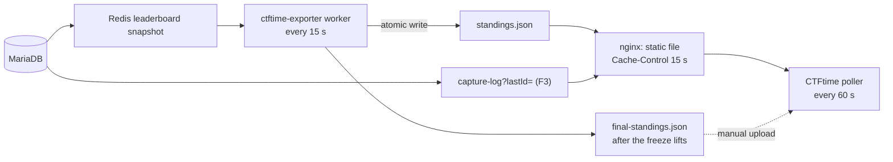
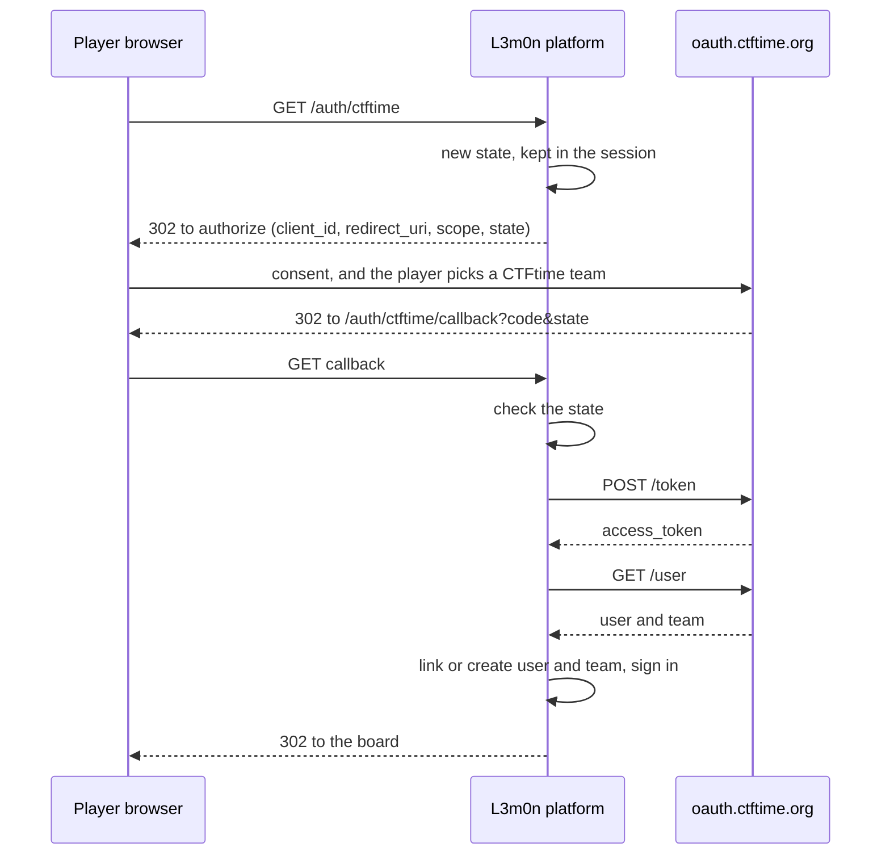

# CTFtime OAuth and the live JSON feed: research and plan

What CTFtime really offers, what other platforms did, what stock CTFd does, and what we should build. Read on 2026-10-03 from CTFtime's pages and issue tracker, CTFd 3.8.8's source, and several independent platform implementations. Companion to the [CTFtime requirements survey](ctftime-requirements.md).

## 1. Verdict

Both are feasible, small, and low risk technically. The risks are non-technical and mostly about timing.

| | Feasible? | Effort | What decides success |
|---|-----------|--------|----------------------|
| **Live JSON feed** | Yes. A static file refreshed every 15 s | 1 to 2 days for the standings feed | CTFtime's own warning against "maximal" feeds, and a feature they describe as "in progress" |
| **Final results JSON** | Yes. Same generator | Included above | A correct, fast upload after the freeze lifts. This is what rating depends on |
| **Login with CTFtime (OAuth2)** | Yes, as a CTFd plugin | 2 to 3 days with a mock provider and tests | The event must be approved and still upcoming or running, and our server's IP may need allow-listing |

The most useful thing to know: **the live feed is optional, and the final results upload is the part that matters for rating.**

## 2. The live JSON feed

### What CTFtime documents ([spec](https://ctftime.org/json-scoreboard-feed))

- **Two feeds**, both public URLs set in the event's management panel after approval. CTFtime polls every **60 seconds**.
  1. **Team standings feed.** `standings[]` with `pos`, `team`, `score`. Optional: `tasks[]`, per-team `taskStats`, `lastAccept`, `outward`.
  2. **Capture log feed.** A JSON array of events, each with an increasing `id`, optional `time`, `type` (`taskCorrect`, `taskWrong`, `flagRead`, `flagWrite`), `team`, `task`, `victim`, `pointsDelta`. CTFtime calls it with `?lastId=N` and expects only newer events. It uses this for "time to first capture" statistics.
- **Final results** are submitted by form: Manage CTFs, Existing CTF events, Manage results. The organiser page says: "Organizers of CTFs without scoreboards or that who not published/provided final scoreboard don't get any rating points."
- A warning on the feed page: **"Feed format development is in progress. Don't implement maximal feeds before the official announce!"** So the safe implementation today is the minimal standings feed.

### How real the feature is

- The organiser page has said the real-time feature is "in progress" since at least 2016 ([CTFd issue 115](https://github.com/CTFd/CTFd/issues/115) quotes the same sentence).
- CTFd's maintainer called the format "restrictive" and dropped first-party support. In 2020 someone reported that CTFtime no longer accepted the feed MajorLeagueCyber produced ([issue 872](https://github.com/CTFd/CTFd/issues/872)). CTFd's docs now say the format "is no longer directly supported".
- On the three events running when I looked, the CTFtime page showed no live scoreboard. I could not find an event whose CTFtime page visibly uses the feed.
- Existing CTFd feed plugins ([durkinza](https://github.com/durkinza/CTFd_CTFTime_endpoint), [SunshineCTF](https://github.com/SunshineCTF/CTFd-scores-ctftime)) exist, but the one I read has two problems: it escapes Unicode with `unicode_escape`, which produces invalid JSON for Latin-1 characters, and it lists every visible challenge, including ones meant to stay hidden until a dependency is solved.

So: build the feed because it is cheap, but do not stake the event on it. Plan for the final upload.

### What we build

| Tier | What | Effort | When |
|------|------|--------|------|
| **F0** | **Final results export** in the feed format, after the freeze lifts, plus a public scoreboard page | included in B12 | P0 |
| **F1** | **Live minimal standings feed**: `pos`, `team`, `score` only | included in B12 | P1 |
| **F2** | Maximal standings: `lastAccept`, `tasks`, `taskStats` | +1 day | only after CTFtime's announcement |
| **F3** | Capture log feed (`taskCorrect` events, `id` from the submission ID) | +1 day | only if CTFtime confirms it is live |



**Design rules**
- **Out of the request path.** A separate worker writes the file atomically (temp file, then rename) and nginx serves it directly. CTFtime polling, scrapers and a CDN can never load the Python app.
- **One source of truth.** The worker reads the same Redis leaderboard snapshot as the public scoreboard (B3), so positions on the site and in the feed always match. Until B3 exists it falls back to CTFd's `get_standings()`.
- **Correct JSON.** Use `json.dumps(..., ensure_ascii=True)`, which emits `\uXXXX` and surrogate pairs correctly. Test with emoji, right-to-left text, quotes and backslashes.
- **Only scored, visible teams.** Teams with a score above zero (CTFtime counts only those). No hidden, banned or staff teams. Guest teams, if we ever show them, carry `outward: true`.
- **Respect the freeze.** The feed shows the frozen standings until we unfreeze. The final export is taken after.
- **Only public challenges** in `tasks` (F2). Secret and finale challenges never appear.
- **Times** in Unix seconds, UTC. **Ties** broken exactly as the scoreboard does.
- **Monitoring.** An alert if the file is older than 2 minutes. A synthetic check that fetches it like CTFtime would.
- **Tests.** A schema check against the spec, unit tests for the cases above, and a poller that fetches every 60 s during the load test.

## 3. Login with CTFtime (OAuth2)

### What CTFtime provides ([docs](https://ctftime.org/for-organizers/oauth/))

| Item | Value |
|------|-------|
| Grant | Authorization Code |
| Scopes | `profile:read` (alias `profile`), `team:read` (alias `team`), space-delimited |
| Endpoints | `https://oauth.ctftime.org/authorize`, `/token`, `/user` |
| Client ID, secret, callback | The client ID is the event ID. The secret and the "OAuth endpoint" (callback URL) are on the event's editing page. Needs an approved event |
| Token request | Works with client credentials in the form body, and with HTTP Basic as well (platforms use both) |

**The `/user` response.** Read from two independent implementations ([rhombus](https://github.com/rhombusgg/rhombus/blob/master/rhombus/src/internal/auth.rs), [yatb](https://github.com/kksctf/yatb/blob/master/yatb/yatb/schema/auth/oauth/ctftime.py)):

```json
{ "id": 123, "name": "...", "email": "...", "country": "IN",
  "team": { "id": 456, "name": "...", "country": "IN", "logo": "..." } }
```

With only `team:read` the app gets just the `team` object, no user identity or email ([CTFtime issue 143](https://github.com/ctftime/ctftime.org/issues/143)). The consent screen lets the player choose which CTFtime team they represent. The `id` and `email` appeared in the profile fields; the exact presence of every field should be confirmed against a real response.

### Operational gotchas (from CTFtime's tracker)

1. **It only works while the event is upcoming or running.** "Using old events is not supported" ([issue 174](https://github.com/ctftime/ctftime.org/issues/174)), so we cannot test against an old event, and cannot test at all before approval without help. Build against a mock provider, then test for real as soon as the event is approved. The maintainer offers to help over DM.
2. **The token endpoint can return 403** because CTFtime sits behind Cloudflare. ENOWARS hit this and had their server IP allow-listed, twice ([issue 326](https://github.com/ctftime/ctftime.org/issues/326), [issue 394](https://github.com/ctftime/ctftime.org/issues/394)). We should send CTFtime our **single, stable egress IP** before the event, and the exchange must run from that IP.
3. **State parameter limits.** An over-long or oddly-shaped `state` returned `invalid state` ([issue 178](https://github.com/ctftime/ctftime.org/issues/178)). We use 16 random bytes as 32 hex characters.
4. **Real use at scale.** The rCTF forks of LA CTF and AmateursCTF carry the integration, and ENOWARS ran it in production (their server IP was allow-listed in two successive years).

### Why stock CTFd is not enough

CTFd 3.8.8 has a generic OAuth flow with configurable endpoints (`auth.py:518-675`), built for MajorLeagueCyber. Against CTFtime it would:
- send **no `redirect_uri`** (CTFtime's own example config adds `OAUTH_CALLBACK_ENDPOINT` for that reason),
- **hardcode the scope** as `profile team` or `profile`,
- **require `email`** in the response (`api_data["email"]` raises a `KeyError` without it),
- rate-limit the callback to **10 per minute per IP**, which a campus NAT would trip,
- give us no control over account and team conflicts or over bracket rules.

CTFd's maintainers declined to merge a CTFtime provider ([PR 1300](https://github.com/CTFd/CTFd/pull/1300)). A config-only trial is possible for a quick smoke test, but the plugin is the real answer.

### What we build: a small plugin, no core edits



| Decision | Choice | Why |
|----------|--------|-----|
| Scope | `profile:read team:read` | CTFd's model needs a **user** identity (`profile` gives `id`, `name`) as well as the team. `team:read` alone gives no user identity |
| Identity keys | `Users.oauth_id` = CTFtime user ID. `Teams.oauth_id` = CTFtime team ID | CTFd already has these columns, and IDs are stable where names change |
| Email | Use it if present, never trust it | It may come from an unverified social account. Brackets that need a verified email stay on normal registration |
| Team name clash | If a team with that name exists without a CTFtime ID, refuse and offer **Link CTFtime** from My Team | Prevents a stranger claiming an existing team's name |
| Team size | Enforce CTFd's limit | A big CTFtime team can only seat as many members as we allow. Players can pick a smaller CTFtime team at consent |
| Tokens | Used once to fetch `/user`, never stored or logged | Minimal exposure |
| Failure | If CTFtime or Cloudflare fails, show "CTFtime login is unavailable, use normal login", and raise an alert | Never block registration |
| Rate limits | Per CTFtime ID and per IP, generous for a campus NAT | The stock 10 per minute per IP would block finalists |
| Admins | OAuth can never log into an admin account | Obvious, and worth a test |
| Privacy | A short notice on our page: CTFtime will share your username, email and chosen team | The consent screen says so too |

A second path, **Link CTFtime**, lets a team that registered normally attach its CTFtime team ID later, so both routes end at the same data.

**Testing.** A tiny mock provider (authorize, token, user, with the real response shape, plus 403 and bad-state cases) in CI. A real end-to-end test the day the event is approved.

**Fallback.** If CTFtime cannot give us OAuth in time: the team-name hint plus an optional CTFtime team URL (B20), and manual checks for the top teams only. Those are the only ones whose rating matters.

## 4. Two-round precedent on CTFtime

An Indian two-round CTF running now, Hacker's Gambit 2026, is listed as two events: [Round 1, an online 48-hour qualifier](https://ctftime.org/event/3380) and [Round 2, the offline Grand Finale](https://ctftime.org/event/3381) (prequalified, on a campus in Pune). Its official URL is a third-party event page, not its own site. So a listing does not need our own domain, only a public page with the details.

Prequalified finals can carry real weights: SAS CTF Finals 49.50 and Srdnlen CTF Finals 25.00. Several Indian finals show 0.00 pending votes (H7CTF Finals, Hacker's Gambit Round 2). Restrictions do not decide rating; the weight does.

## 5. What this changes

| Change | Detail |
|--------|--------|
| **B12 split** | B12a minimal standings feed and file worker (P1), B12b final results export (P0), B12c capture log and maximal feed (P2, only after CTFtime confirms) |
| **B21 raised** | "Login with CTFtime" moves from P2 to **P1**, because it prevents name mismatches, gated on approval |
| **New** | A stable egress IP for the server, sent to CTFtime. A mock CTFtime provider for tests |
| **Listing can start sooner** | A public page with the event details is enough for the submission. We do not have to wait for the full landing site |

## 6. Questions for CTFtime

Put them on [their issue tracker](https://github.com/ctftime/ctftime.org/issues) or to the maintainer, who answers quickly there:
1. Is the live feed polled and displayed today, or only the final results? Is the minimal feed safe to ship, and when is the "maximal" format announced?
2. How soon after submission is a new event approved? Can a test event be enabled for OAuth development?
3. Can our server's static IP be allow-listed on the token endpoint?
4. Does the `/user` response include `email` only with `profile:read`, and which fields does `team:read` return?
5. Can the prelims and the prequalified finals be two events in one series, and how do we link them?
6. How should organisers' own team appear on the scoreboard?

## 7. Sources

[Scoreboard feed](https://ctftime.org/json-scoreboard-feed) · [For organizers](https://ctftime.org/for-organizers) · [OAuth2 configuration](https://ctftime.org/for-organizers/oauth/) · [CTFtime issue tracker](https://github.com/ctftime/ctftime.org/issues) · [CTFd PR 1300](https://github.com/CTFd/CTFd/pull/1300) · [CTFd issues 872, 1939, 115, 101](https://github.com/CTFd/CTFd/issues/872) · [CTFd scoring docs](https://docs.ctfd.io/docs/scoring/overview/) · [rCTF CTFtime docs](https://rctf.osec.io/integrations/ctftime) · [rCTF source](https://github.com/redpwn/rctf) · [rhombus](https://github.com/rhombusgg/rhombus) · [yatb](https://github.com/kksctf/yatb) · [EnoCTFPortal](https://github.com/enowars/EnoCTFPortal) · [CTFd feed plugin](https://github.com/durkinza/CTFd_CTFTime_endpoint) · CTFd 3.8.8 `CTFd/auth.py`.
