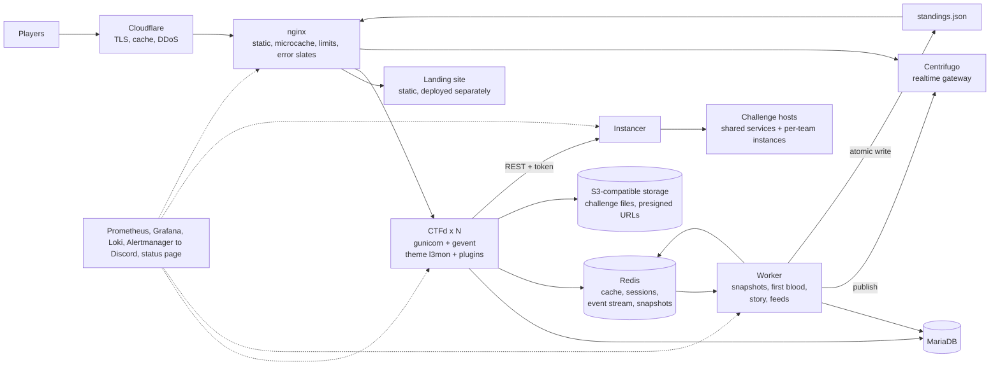
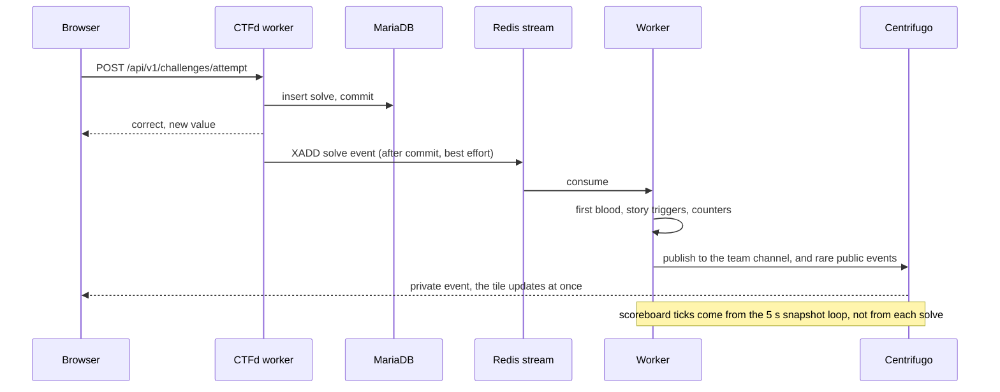

# L3m0nCTF 2026 platform: build design (Task 4)

Status: **draft, 2026-10-04, revised the same day with the site essentials.** It turns the preferred choices (CTFd 3.8.x extended by plugin and theme, code-led visuals, story overlay, the page concepts, CTFtime listing) into a buildable design. It replaces the sketch in [doc 03](../../analysis/03-options-and-recommendation.md) section 3. Story and visual details stay in the private repo; this document carries no story material.

**The technology choices here are a proposal.** The project owner cannot approve a stack: the department's leadership decides. The four-page proposal PDF (private repo, `proposal/`) is the short version written for them. Until they decide, work continues only on parts that do not depend on the stack: the landing page, the author-kit documents, design assets and this documentation.

Inputs: [01 CTFd core](../../analysis/01-ctfd-core.md), [02 last year's fork](../../analysis/02-last-year-fork.md), [03 options](../../analysis/03-options-and-recommendation.md), [CTFtime requirements](../../research/ctftime-requirements.md), [CTFtime OAuth and live feed](../../research/ctftime-oauth-and-live-feed.md), and the approved page concepts (private).

## 1. Goal and non-goals

**Goal.** A CTFd-derived platform that runs a 24-hour online Jeopardy prelims for up to 1,000 teams, is listed on CTFtime, carries the story overlay, does not look like CTFd, and is reused for the finals. It is verified end to end before the feature freeze (section 8).

**Non-goals.**
- Editing CTFd's own files. Everything is a plugin, a theme or a service beside it.
- Running challenge code on the web tier.
- User-uploaded avatars, a custom admin UI (the stock admin stays, locked down), a mobile app, an offline or LAN build, payments.

## 2. Fixed points and assumptions

Fixed by your approvals: option A, story as an overlay on an open board, code-led visuals, the eleven page concepts, CTFtime listing, a 1,000-team capacity target, work lands on `pre-deployment` before `main`.

Assumptions. Each one is a place where a different answer changes the design, so they are also listed as decisions in section 10.

| # | Assumption | If it is wrong |
|---|------------|----------------|
| A1 | Prelims start Saturday 2026-11-14, freeze Saturday 2026-11-07 | The calendar in section 7 shifts. Nothing else changes |
| A2 | Hosting is plain Linux VMs with Docker: one app host (8 vCPU, 16 GB or more), two to four challenge hosts (8 vCPU, 16 GB each), one small ops host, a static IP for the app host, and wildcard DNS for instances. The challenge-host count follows the instance target: about 500 live instances at 128 MB each is about 64 GB of RAM | If you have Kubernetes, the instancer choice changes (section 6, SP4). If hosting is weaker, the load and instance targets drop |
| A3 | An official domain exists or will exist within days | Email deliverability, TLS and the CTFtime URL all wait for it. A GitHub or Cloudflare Pages address works as the interim public page |
| A4 | A transactional email provider, with SPF, DKIM and DMARC set up on our sending domain | Verification emails land in spam or are rejected, and registration stalls |
| A5 | Cloudflare (free plan) sits in front of the web and landing hostnames. Instance TCP ports are not proxied | Without it, DDoS protection and edge caching of static files come from nginx alone |
| A6 | You and I build. About 30 authors write challenges in parallel. A named person owns DevOps during the event | Someone must be on call. This is the biggest non-technical gap |
| A7 | About one in five challenges needs a per-team instance. The rest are files or shared services | A higher share raises instancer and host sizing |

## 3. Architecture



**Rules that keep it fast and safe**
1. **The request path stays thin.** Anything derived (scoreboard, board model, first blood, story progress, feeds) is computed by the worker and read from Redis. CTFd workers do CRUD and serve the page.
2. **Scoreboard truth is the database.** The worker takes a snapshot every 5 seconds from CTFd's own standings function, so ranks always match CTFd's rules (tie-break, hidden teams, freeze, brackets). There is no incremental leaderboard to drift.
3. **Events are nudges, not data.** A realtime message says "version 812 is out". Clients refetch with an ETag and mostly get a 304. Payloads stay tiny.
4. **Helpers can fail without taking the player path down.** If the worker or the gateway stops, solves still commit, the board falls back to a slower direct read from the database, and pages fall back to polling. Redis is different: sessions and the cache live there, so it gets persistence, a restart policy, monitoring and a failure drill (section 8).
5. **The web tier has no Docker socket and no route to challenge hosts except the instancer API.**

### Components

| Component | Runs as | Responsibility | State | How it scales |
|-----------|---------|----------------|-------|---------------|
| nginx | container | TLS, static and theme assets with immutable cache headers, microcache for public GETs, request limits, static error slates, `/admin` allow-list | none | one per app host |
| CTFd | image, N gunicorn+gevent workers | Auth, teams, challenges, submissions, admin, REST API | MariaDB, Redis | add workers or a second app host (sessions are in Redis, files in S3) |
| `l3mon` theme | built static assets plus Jinja templates | Every player page | none | served by nginx |
| Plugins | inside the CTFd image | See section 6 | MariaDB tables via plugin migrations | with CTFd |
| Worker | same image, second command | Snapshotter, event handlers, feed writer | Redis, reads MariaDB | one active (Redis lock), one standby |
| Centrifugo | container (Apache-2.0) | Realtime fan-out over WebSocket with HTTP streaming and SSE fallbacks, channel history | Redis | one node is ample for 2,500 connections |
| MariaDB | container or host | System of record | disk | tuned pool, off-host backups |
| Redis | container | Cache, sessions, event stream, snapshots | RAM, persistence on | one node |
| S3-compatible storage | Cloudflare R2 or MinIO | Challenge files, served by presigned URL so downloads never touch Python | objects | provider |
| Instancer | service on each challenge host | Per-team instances, TTL, quotas, limits, per-team flags | Redis and Docker labels | one agent per host, a small scheduler picks the host |
| Ops stack | containers on the ops host | Metrics, logs, alerts, status page | volumes | small |

## 4. Key decisions, with the options considered

| Topic | Options | Choice | Why |
|-------|---------|--------|-----|
| Theme | (a) server-rendered Jinja shell plus small JavaScript islands, (b) a single-page app inside the theme, (c) restyle the stock theme | **(a)** | Forms work without JavaScript, text mode is the same routes, the JavaScript budget is easy to hold, and one theme build ships with the image. A single-page app costs more bytes and breaks the no-JavaScript fallback |
| Realtime | (a) CTFd's built-in event stream, (b) a thin custom service, (c) **adopt Centrifugo** | **(c)** | The built-in stream holds one greenlet per tab and only carries admin notifications. A custom service is code we would have to harden. Centrifugo is Apache-2.0, supports WebSocket, HTTP streaming and SSE, channel history with recovery, a Redis engine and JWT auth |
| Scoreboard load | (a) patch CTFd's cache behaviour, (b) read replica, (c) **snapshot worker plus nginx microcache** | **(c)** | CTFd 3.8.8 clears its standings and challenge caches on every flag submission, wrong ones included, so under load they are nearly always cold. Snapshots decouple ranking cost from submission rate and need no core change |
| Challenge files | (a) nginx X-Accel redirects, (b) **S3-compatible storage with presigned URLs** | **(b)** | CTFd supports an S3 uploader out of the box. Large downloads never occupy a Python worker |
| Instancer | (a) **thin service on Docker hosts**, (b) `ctfd-whale` (Swarm and frp), (c) `ctfd-chall-manager` (Kubernetes and Pulumi) | **(a)** unless you have Kubernetes | Smallest ops surface in six weeks. Revisit if A2 changes |
| Deployment | (a) **compose on VMs, blue/green behind nginx**, (b) Kubernetes | **(a)** | Fewer moving parts for a four-week build and a single event |
| Plugin boundary | patch core, or stay in extension points | **Extension points only**: blueprints, challenge types, config, SQLAlchemy listeners, Flask hooks. Where a public function must be wrapped, a startup check fails loudly if CTFd's version differs from the pinned one | Keeps upgrades possible and the diff against upstream empty |

## 5. Data flows and contracts

### A solve



The hook is a SQLAlchemy `after_insert` listener on the solve model, so it covers every challenge type. It queues the event during the transaction and publishes only after the commit, and it is wrapped so a failure is logged and never fails the submission. Wrong submissions, hint unlocks and announcements use the same mechanism. A reconciler rebuilds derived state from the database every few minutes, so a lost event only delays a notification.

### Public interfaces added by the plugins

| Interface | Auth | Caching | Notes |
|-----------|------|---------|-------|
| `GET /api/v1/l3mon/board` | session | ETag, private | Channels, tiles, state per tile for this team, solve counts, first-blood flags, meter. One request renders the board. Built from a cached challenge-metadata blob, the latest snapshot, and this team's solved set |
| `GET /api/v1/l3mon/scoreboard` | public | microcache 5 s | From the snapshot. Brackets, search and paging server-side |
| `GET /api/v1/l3mon/ticks` | public | microcache 3 s | `{ver, ts}`. The polling fallback |
| `GET /api/v1/l3mon/realtime/token` | session | none | Short-lived connection token that also grants the channel subscriptions |
| `GET /ctftime/standings.json` | public | static file, 15 s | Written by the worker, served by nginx. See SP8 |
| `GET/POST/DELETE /api/v1/l3mon/instances/...` | session | none | Start, status, renew, stop |
| `GET /text/...` | session or public | per page | Text mode, the no-JavaScript view |
| Stock `/api/v1/challenges/<id>` and `/attempt` | session | none | The programme panel uses these directly |

Stock `/api/v1/challenges`, `/scoreboard` and `/api/v1/scoreboard` stay available for tools but are rate-limited at the edge, and the theme does not call them.

**Contract tests.** The new board and scoreboard endpoints must return the same visible challenge set and the same ranking as the stock endpoints for the same fixtures (hidden, locked, prerequisite, dynamic-value, tie, freeze, bracket cases). This is how we know the reimplementation is faithful.

### Realtime channels

| Channel | Who | Content | History |
|---------|-----|---------|---------|
| `pub:ticks` | everyone | `{ver}` at most once a second | 1 message |
| `pub:events` | everyone | first blood, story milestone, announcement | 50 messages, 10 min |
| `team:ID` | that team only | own solve, hint unlocked, instance expiring, story unlock | 20 messages, 30 min |

Clients are subscribed on the server side through the `channels` claim of the connection token, so there are no per-channel tokens. Fan-out is bounded by design: public channels carry coalesced ticks and rare events, never one message per solve. History only smooths short reconnects. After any reconnect the client refetches the board and scoreboard, so correctness never depends on message recovery.

### Errors, busy mode and what the player sees

The rule: a page load gets an HTML slate, an API call gets JSON with the same status and a `retry_after`, and the status code always says what is wrong.

| Situation | Status | Page load | API call | Produced by |
|-----------|--------|-----------|----------|-------------|
| Server overloaded ("server busy") | 503 and `Retry-After` | Busy slate with a retry bar and a `meta refresh` | `{"error":"busy","retry_after":6}`. The client waits a random 2 to 8 s and never retries faster | nginx concurrency cap |
| One person or address going too fast | 429 and `Retry-After` | "Too many requests" slate with a countdown | Inline message with a countdown | nginx and CTFd |
| Not allowed (admin area, hidden page, blocked address) | 403 | "Restricted" slate with a way back | `{"error":"forbidden"}` | CTFd and nginx |
| Not found | 404 | Slate linking to the board and the rules | 404 JSON | theme |
| App error | 500 | Slate with a request ID and a "report this" button | JSON with the request ID | theme and nginx |
| App restarting or down | 502 or 504 | Static slate with auto-retry | `{"error":"restarting"}` | nginx, with the app fully off |
| Planned maintenance | 503 | Static slate with a countdown | As for busy | nginx reading a flag file |
| Before the start, after the end, frozen scoreboard | 200 with a banner, or the not-started, ended or frozen slate | Slates and banners | Normal data with a `phase` field | theme and config |
| Suspended team or account | 403 | "Off air" slate with a contact and an appeal route | JSON | theme |

- **Why busy is 503, not 403.** 403 means "you may not", and browsers, CDNs and monitoring treat it as final. 503 means "try again later": it is retried, never cached, and is what an overloaded server should say. 429 is for one person going too fast. We still ship a 403 slate for real permission problems.
- **Flag submission is a special case.** CTFd 3.8.8 answers some submission problems with 403 or 429 and a JSON body (for example "another submission is already being processed" and "no tries left"). The programme panel therefore shows any JSON reply from the submit call as an inline message, never as a page error.
- **Busy mode has three levels.** (1) Shed, automatic: nginx caps concurrent requests to the app, gives flag submissions their own cap so submitting never starves, and answers the excess with the busy slate or JSON. (2) Waiting room, an admin switch, built later or bought: new sign-ins are admitted at a set rate and everyone else sees a "you are in line" page that checks back by itself, while existing sessions bypass it. (3) Maintenance, an admin switch: nginx serves the static slate from a flag file, so the app can be off.
- **Smoothing the start.** The landing page releases "Enter" after a random 0 to 20 s per visitor, so two thousand teams do not arrive in the same second. Hashed assets come from the edge cache, and the first board load is one cached request per team.
- **Every error slate** carries a request ID, `Cache-Control: no-store` and, where it applies, `Retry-After`. The 5xx, busy and maintenance slates are static files served by nginx, so they appear even when the app is completely down.

## 6. Sub-projects

Each gets its own plan, then implementation on `pre-deployment`, then staging verification and your approval. Effort is a rough estimate in working days for one builder and will be reviewed in each plan.

### SP0 Foundation (3 to 4 days)

**Delivers.** Monorepo skeleton (below), a CTFd 3.8.8 image with safe dependency bumps and our plugins and theme baked in, compose stacks for dev, staging and production, nginx and MariaDB and Redis configuration, config as code (`config/event.yaml` and a seed tool that rebuilds a working instance from an empty database in minutes), CI, and the `pre-deployment` to staging deploy.
**Done when.** `docker compose up` gives a working CTFd with the empty `l3mon` theme and plugins loaded, CI is green (lint, unit tests, CTFd's own suite, `pip-audit`, image scan, hygiene scan), a push to `pre-deployment` updates staging, and a restore from backup is rehearsed once.
**Notes.** MariaDB `max_connections` must exceed workers times pool size. Sessions in Redis, `SECRET_KEY` set, `WORKERS` matched to cores. CTFd's own tests run against our plugin set, so upgrades stay safe.

```
.
├─ deploy/       compose files, nginx, mariadb, centrifugo, prometheus, grafana, runbooks, scripts
├─ docker/ctfd/  Dockerfile: pinned CTFd, dependency bumps, plugins, built theme
├─ plugins/      l3mon_core, l3mon_story, l3mon_guard, l3mon_ctftime, l3mon_instances
├─ services/     worker, instancer
├─ ui/           theme sources (Vite, TypeScript), landing site, tile pipeline, design tokens
├─ config/       event.yaml (public example), JSON schemas for every config file
├─ tests/        contract, e2e, load
└─ tools/        the l3mon command line: seed, sync, export
```

The private repo holds the real challenges, story, flags, channel grouping and secrets.

### SP1 Public landing page and CTFtime pack (2 to 3 days, first)

**Delivers.** The static landing page from the approved startup concept: name, dates in UTC and IST, format, rules, prizes, registration link, scoreboard link, contact, organiser, Open Graph tags, schema.org `Event`, a countdown, the rules, FAQ, privacy and contact pages, `robots.txt`, `sitemap.xml`, `security.txt`, and the icon and share-card set (see site essentials). Deployed separately (Cloudflare Pages with `pre-deployment` previews, or GitHub Pages) so it survives platform outages. A one-page CTFtime submission pack (event text, logo, links, restrictions to tick).
**Done when.** It is public, under 60 KB on first load, passes accessibility checks, and the CTFtime submission can be filed. This unblocks listing, which has an unknown lead time.

### SP2 Author kit and challenge pipeline (4 to 5 days, first)

**Delivers.** In the private challenges repo: a challenge template with `challenge.yml` (ctfcli format plus an `l3mon:` block for channel, order, optional tile image and story hooks), a `solution/solve.py` convention, Dockerfile templates for web, pwn (nsjail), crypto, Web3 (private chain per instance), LLM (guarded proxy), and file-only categories, a review checklist, and CI that lints the schema, checks the flag format, builds the image with hardening flags, starts it, runs `solve.py` against it and requires the flag to match, and scans for secrets and oversize files. A `l3mon sync` command pushes challenges and metadata to staging.
**Done when.** One sample challenge per template passes CI and appears on the staging board, and the 30 authors have a one-page guide. Shared (non-instance) challenges deploy as plain compose projects on a challenge host.

### SP3 Data pipeline: snapshots, board and scoreboard APIs, realtime (5 to 6 days)

**Delivers.** The plugin `l3mon_core` and the worker: the after-commit event hook, the 5 s snapshotter (it calls CTFd's own `get_standings` through the `uncached` original that Flask-Caching keeps on every memoised function, so ranking rules stay CTFd's; to be confirmed against the pinned Flask-Caching 2.3.1 in the plan), the board and scoreboard and ticks endpoints, the realtime token endpoint, Centrifugo configuration, nginx microcache rules, metrics. When the snapshot is older than 30 s the endpoints compute from the database, rate-limited, and an alert fires.
**Done when.** Contract tests pass, p95 for the board endpoint stays under 150 ms at 400 requests per second on the staging host, the scoreboard reflects a solve within 5 s, killing the worker or the gateway degrades gracefully, and the stock endpoints are rate-limited at the edge.

### SP4 Instances and dynamic flags (8 to 10 days)

**Delivers.** The `l3mon_instances` challenge type and the instancer. API: start, status, renew, stop. Quotas (about three live instances per team, one per challenge, restart cool-down). TTL about 45 minutes, renewable. Hardened containers (CPU, memory and pid limits, `no-new-privileges`, all capabilities dropped, read-only root where possible, tmpfs), per-instance networks, egress blocked, no metadata addresses, images from a private registry. HTTP instances through a reverse proxy on wildcard hostnames, TCP instances on a port range. Docker socket only inside the instancer, behind a socket proxy that allows only the verbs it needs. Per-team flags: the instancer injects `HMAC(secret, team, challenge)` formatted as the flag, and CTFd verifies by recomputation, so nothing per-team is stored. Reaper loop, reconcile on boot, admin kill-all.
**Done when.** About 100 instances run on one 16 GB challenge host within their limits (the packing limit is measured, not guessed), the scheduler spreads instances across hosts and the fleet is sized for about 500 live instances, an instance cannot reach another instance, the host or the internet (tested), TTL and renewal behave, and a flag from team A submitted by team B is rejected and recorded as evidence (SP5).
**Fallbacks.** If time runs short: HTTP-only first, TCP and Web3 second. If A2 turns out to be Kubernetes, adopt `ctfd-chall-manager` instead and shrink this to an integration.

### SP5 Anti-abuse suite (5 to 6 days)

**Delivers.** `l3mon_guard`: mandatory email verification, a disposable-domain blocklist, CAPTCHA (Cloudflare Turnstile) on register, login after failures and reset, per-account and per-team limits (CTFd's own per-account submission limit stays authoritative), NAT-aware IP heuristics (campus ranges allow-listed, no IP-only bans), a team-name policy (case-insensitive unique, CTFtime-name hint), an evidence table and an admin review queue (cross-team flag reuse, burst patterns, shared devices). Human decisions only: no automatic bans beyond hard rate limits.
**Done when.** Scripted abuse scenarios (mass registration, credential stuffing, flag brute force, flag sharing) are blocked or logged, and a campus-sized NAT does not trip any limit in the load test.

### SP6 Theme and tile pipeline (15 to 20 days in two phases, the largest)

**Delivers.** The `l3mon` theme for every player page in the approved concepts: landing mirror, login, four-step registration, board, programme panel, teams and team pages, scoreboard, text mode, live wall, notifications, plus the error and state slates, account gates, announcements, report-a-problem form and accessibility parts listed under site essentials. Sources in `ui/` (Vite, TypeScript, small web components, no framework runtime), design tokens shared with the landing site, and a build-time **tile pipeline** that slices each channel picture into tiles and writes two WebP variants per tile (clear about 6 KB, distorted about 2 KB) plus a manifest. No filters run in the browser in production.
**Mapping to CTFd.** Templates override CTFd's by name (`base`, `challenges`, `scoreboard`, `teams/*`, `users/*`, `settings`, `login`, `register`, `reset_password`, `confirm`, `page`, `errors/*`). CTFd's auth and team logic and rate limits stay as they are. The admin theme is untouched.
**Budgets (CI gates).** Landing 60 KB or less on first load. Board JavaScript 120 KB gzipped or less, CSS 40 KB or less, fonts 90 KB or less. Scoreboard under 30 KB gzipped for 100 rows. Text mode 15 KB or less per page. WCAG AA, keyboard everywhere, reduced motion honoured, a CLEAN switch, state never carried by colour or blur alone, no runtime third-party CDNs.
**Done when.** Every page works at 375, 640, 820 and 1180 px, works without JavaScript where it should, passes axe and the Lighthouse budgets in CI, and the end-to-end scenarios in section 8 pass against it.

### SP7 Story overlay engine (6 to 8 days)

**Delivers.** `l3mon_story`: nodes with triggers (a given solve, a channel count, the global meter), per-team progress in the database with a Redis cache, a global meter computed by the worker, lore unlocks, fragments as secret shares (any K of N reveal the finale), a finale meta-challenge hook, an auto-air fallback at a set time so the story ends even if few teams solve, a story-mode toggle (a plain CTF mode with the story hidden), and an admin editor. The story content itself is private config synced by `l3mon story sync`.
**Done when.** Meter and unlock events reach every client live, a team's unlocks are private to it, the K-of-N threshold and the fallback are covered by tests with a fake clock, and switching story mode off hides every story surface without breaking scoring.

### SP8 CTFtime integration (4 to 5 days)

**Delivers.** `l3mon_ctftime`, following the [research](../../research/ctftime-oauth-and-live-feed.md): the worker writes a minimal `standings.json` every 15 seconds (atomic, valid JSON, scored and visible teams only, freeze respected) which nginx serves directly (B12a); a final results export in the feed format after the freeze lifts (B12b, P0); a "Login with CTFtime" OAuth2 plugin with `profile:read team:read`, linking on CTFtime IDs, no stored tokens, never for admin accounts, and a "Link CTFtime" path from My Team (B21); a mock CTFtime provider for CI (B23); a stable egress IP to give CTFtime. The capture-log and maximal feeds wait for CTFtime's confirmation (B12c).
**Done when.** The feed validates against the published schema including emoji, right-to-left and quote cases, the file is never older than 2 minutes (alert), OAuth passes the mock-provider cases (success, 403, bad state, name clash, size limit), and a real end-to-end test is run the day the event is approved.

### SP9 Operations (6 to 8 days, runs alongside)

**Delivers.** Prometheus, Grafana and Loki with dashboards (event, database, hosts, instances), alerts to Discord (5xx rate, p95 latency, database connections, Redis memory, disk, feed staleness, instancer errors, worker lag), busy mode (nginx concurrency caps, the flag-file maintenance slate and the admin switches), a public status page, `/healthz` and `/readyz`, an admin audit log, security headers, off-host backups (a full dump every 30 minutes plus binary logs shipped every minute, so about 5 minutes of data at risk) with a restore drill, a mail relay container with a queue so registration never waits on the provider, `/admin` restricted to a VPN or allow-list, secrets handling, runbooks (start-of-event, outage, DDoS, database failover, freeze scoreboard, emergency announcement, kill instances, rotate secrets, roll back a deploy), the k6 load suite, a security review (threat model, configuration checklist, instancer test), and a dress rehearsal.
**Done when.** The load test passes at twice target (section 8), the restore drill meets RTO 15 minutes, every alert has fired once on purpose, and the runbooks have been followed by someone other than their author.

### SP10 Finals mode (2 to 3 days, after the prelims)

Round gating, finalist import and carry-over, per-round boards, campus-IP allowances, and a second CTFtime event. Specified after the prelims, once finalist count and format are known.

### Cross-cutting: site essentials (about 6 builder-days, spread over SP1, SP6, SP9 and SP5)

The small parts that make a site feel finished. Pictures of the main ones are in the pages atlas (private repo, tabs 9 and 12; tab 12 is new and not yet reviewed). Each has an owner and a tier (section 7).

| Group | Items | Owner | Tier |
|-------|-------|-------|------|
| Error and state pages | 403, 404, 429, 500, 502 and 504, server busy, waiting room, maintenance, not started, ended, frozen, suspended, registration closed. Contract in section 5 | SP6 and nginx | A, except the waiting room (C) |
| Account gates | Email not verified (resend with a cool-down), team required, session ended (the typed flag survives the sign-in), password reset sent or expired, invite-link join page | SP6 | A |
| Info and legal pages | Rules, code of conduct, privacy notice (what we collect, how long, what CTFtime sees), essential-cookies notice, terms, contact, FAQ, prizes, sponsors, credits, accessibility statement, press kit | SP1 | A for rules, privacy, contact and FAQ, B for the rest |
| Discovery and sharing | Favicon and app-icon set, web manifest, Open Graph and Twitter cards, schema.org `Event`, `robots.txt`, `sitemap.xml`, `security.txt` with a disclosure policy (the platform is out of scope for players), `humans.txt` | SP1 | A |
| Help and communication | Announcements bar and a notifications page, emergency banner, a "report a problem" form prefilled with team, programme, browser and request ID, a "report an issue" button on each programme, clarifications page, email templates (verify, reset, invite, welcome, reminders), prepared incident messages, Discord link | SP6 and SP9 | A for announcements, the report form and the email templates, B for clarifications |
| Gameplay details | Flag-format helper, copy buttons, file checksums, hint-cost confirmation, locked-until messages, scheduled drops with a "new programme airing" event, first-blood banner, challenge ratings, claim-a-challenge for teammates | SP6, SP3 and SP7 | A for the first four, B for the rest |
| Operations and trust | Public status page, `/healthz` and `/readyz`, version stamp, request IDs in logs and slates, admin audit log, staff test accounts hidden from the scoreboard, time sync on every host, log access limits (logs hold flag attempts) | SP9 and SP5 | A |
| Accessibility and comfort | Skip link, focus rings, live-region announcements, high-contrast CLEAN mode, reduced motion, shortcut help, UTC or IST toggle, clock-skew warning, notices for no JavaScript, blocked cookies and old browsers | SP6 | A |
| Security headers and edge | CSP, HSTS, referrer and permissions policy, Cloudflare WAF and bot rules, rate rules on login and register, `/admin` allow-list, DNS records for email (SPF, DKIM, DMARC) | SP9 | A |
| After the event | Final results page, CTFtime final upload, certificates with a verify link, winners page, writeups hub, archive, personal-data retention and deletion | SP8 and SP10 | C |

## 7. Build order and calendar

```mermaid
gantt
  dateFormat YYYY-MM-DD
  title Build calendar, assuming prelims start on 2026-11-14
  section Foundation
  SP0 repo, image, compose, CI, staging :a1, 2026-10-05, 6d
  SP1 landing page and CTFtime pack :a2, 2026-10-05, 6d
  SP2 author kit :a3, 2026-10-05, 7d
  section Core
  SP3 pipeline and APIs :b1, 2026-10-11, 8d
  SP6 theme: auth, board, panel :b2, 2026-10-11, 12d
  SP4 instancer, HTTP first :b3, 2026-10-12, 10d
  SP5 anti-abuse basics :b4, 2026-10-16, 6d
  Staging open to authors :milestone, msa, 2026-10-18, 0d
  section Identity
  SP7 story engine :c1, 2026-10-20, 10d
  SP8 CTFtime feed and OAuth :c2, 2026-10-22, 6d
  SP6 theme: scoreboard, teams, text, slates, wall :c3, 2026-10-22, 10d
  section Ship
  Production hosting, email, registration opens :d1, 2026-10-24, 7d
  SP9 observability, backups, runbooks :d2, 2026-10-26, 8d
  Load test at 2x, fixes, security review :d3, 2026-11-02, 5d
  Feature freeze :milestone, msf, 2026-11-07, 0d
  Dress rehearsal :d4, 2026-11-08, 5d
  Prelims :milestone, msp, 2026-11-14, 0d
```

**Milestones**

| | Date | What must be true |
|---|------|-------------------|
| M0 | Oct 11 | Landing page public, CTFtime submission filed, author kit v0 in the authors' hands, staging deploys on push |
| M1 | Oct 18 | Staging works end to end with stock pages plus the new data APIs: register, team, sample challenges, solve, scoreboard from the snapshot. Authors are deploying to it. The new theme's login, board and panel follow by Oct 23 |
| M2 | Oct 31 | **Registration is open on production.** Hosting is provisioned, email deliverability tested, anti-abuse basics live. Registration usually opens one to two weeks before a CTFtime event, so production must exist early |
| M3 | Nov 1 | Feature complete on staging (tiers A and B). Load test at twice target begins on Nov 2 |
| M4 | Nov 7 | Feature freeze. Security review done. Every challenge deployed on staging with a passing solver |
| M5 | Nov 13 | Dress rehearsal complete, go or no-go |

**First implementation plan:** SP0, SP1 and SP2 together. They unblock the CTFtime listing, the authors and everything after them. Each later sub-project gets its own plan when its turn comes.

**Capacity check.** Added up, the estimates in section 6 and the site essentials come to about 64 to 82 builder-days. There are about 25 weekdays (34 calendar days) from Oct 5 to the freeze, and the tier A work alone is about 42 to 52 days on the same scale. Code written with me is faster than a solo builder, but review, hosting, DNS, email, the authors' challenges and load testing take the same wall-clock time, so the plan cannot assume tier B ships. Ways to compress, in order:
1. Agree the tiers now, and agree that the freeze date wins over features (D17).
2. Run independent sub-projects in parallel, each in its own git worktree, for example SP0, SP1 and SP2 in week one (needs your go-ahead to use sub-agents, D18).
3. Bring in a DevOps owner for SP9 and production hosting, and one front-end helper for the secondary theme pages.
4. If the load test or the security review fails late, a short slip of the prelims is cheaper than running unverified.

**Scope tiers.** The calendar holds only if the lower tier is allowed to slip.

| Tier | Contents |
|------|----------|
| **A: the prelims cannot run without it** | SP0, SP1, SP2, SP3 (snapshots, board, scoreboard, microcache), SP6 core pages (auth, board, panel, scoreboard, teams, slates), SP5 basics, SP4 for HTTP instances, SP9 basics (alerts, backups and a restore drill, load test, runbooks), the final results export, and the site essentials marked A in section 6: every error and busy slate, the account gates, rules, privacy, contact and FAQ pages, discovery files, announcements, the report form, the status page, health endpoints, accessibility basics and security headers |
| **B: the event's identity, built right after A** | SP7 story overlay (meter, lore, finale), realtime ticks, text mode, the live minimal feed, OAuth, TCP and Web3 instances, dynamic-flag sharing detection, live wall, clarifications page, scheduled drops, the remaining info pages |
| **C: after the prelims** | SP10 finals mode, mascot shuffle, per-channel standings pages, the grid list view, the waiting room, certificates, winners page and writeups hub, post-event archive, optional LLM hint buddy, dynamic-score optimisation |

## 8. How "verified end to end" is defined

**Layers.** Unit tests per plugin and the worker. Contract tests against stock CTFd endpoints. Integration tests on the compose stack (CTFd, MariaDB, Redis, a mail catcher, a mock CTFtime provider). Playwright end-to-end scenarios. k6 load tests. Accessibility and budget checks. Resilience drills. A dress rehearsal with the authors as players.

**End-to-end scenarios (all must pass in CI on the compose stack, and again on staging before M4)**

| # | Scenario |
|---|----------|
| S1 | Register, verify email, create a team, land on the board |
| S2 | Join with an invite code, team-size limit enforced |
| S3 | Wrong login gives one generic message, throttling shows the slate, CAPTCHA appears after failures |
| S4 | Board renders within budget, channel switching works, signal and filters correct |
| S5 | Open a programme, download a file by presigned URL, unlock a hint (score drops), wrong flag, correct flag: the tile clears, scoreboard updates within 5 s, the CTFtime file within 15 s |
| S6 | Dynamic-value decay changes every solver's score, and our scoreboard equals the stock ranking |
| S7 | Instance: start, connect, TTL, renew, stop, expire, quotas, unique flag, cross-team flag recorded as evidence |
| S8 | Story: meter advances, public unlock reaches all clients, private unlock reaches only one team, K-of-N finale and the fallback work under a fake clock, story mode off hides everything |
| S9 | Kill the gateway: the page falls back to polling, then resumes |
| S10 | Freeze and unfreeze, final export matches the CTFtime schema |
| S11 | CTFtime OAuth against the mock provider (success, 403, bad state, name clash), and an admin account cannot be signed in through it |
| S12 | App down: nginx serves the static slate, and maintenance mode shows the countdown |
| S13 | Busy mode: above the concurrency cap, page loads get the 503 slate and API calls get JSON with `Retry-After`, the client backs off with jitter, and flag submissions still succeed while pages are shed |
| S14 | Error contract: every status in the table in section 5 shows its slate, and a 403 or 429 JSON reply from the submit call appears inline in the panel, never as a page |
| S15 | Info and discovery bundle: `robots.txt`, `sitemap.xml`, `security.txt`, the web manifest, the icon set and the share card all resolve, and the `Event` markup validates |
| S16 | Account gates: an unverified email lands on the gate, a suspended team on the off-air slate, and an expired session keeps the half-typed flag through sign-in |

**Load gates (at twice the target in the table in doc 03).** About 5,000 concurrent browsers, 800 requests per second mixed, a 4,000-load burst in 60 seconds at start, 140 flag submissions per second. p95 under 300 ms and p99 under 1 s for reads, errors under 0.1%, scoreboard within 5 s, and as many live instances as the staging challenge hosts allow, up to the 500 target. Run on the real staging hardware; on a laptop only relative numbers are meaningful.

**Resilience drills.** Kill a CTFd worker, the worker process, Redis, the gateway and the instancer in turn. Restore the database from backup. Let the feed file go stale and confirm the alert. Fill the disk to 90% and confirm the alert.

**Security.** Threat model for the instancer and the admin surface, `pip-audit` and image scans in CI, a ZAP baseline scan against staging, secrets only outside git, admin routes behind an allow-list.

## 9. Risks

| Risk | Mitigation |
|------|------------|
| Capacity: the estimates are about two to three times the weekdays to the freeze (section 7) | Tiers and the rule that the freeze wins over features, adopt over build (Centrifugo, S3 storage, Turnstile), parallel sub-projects if allowed, extra hands for operations and the secondary pages, authors playtesting in parallel |
| CTFtime listing lead time is unknown | SP1 first, the submission is filed on M0 |
| Production hosting, domain or email arrive late | They are decisions this week (section 10). M2 depends on them |
| Instancer security | Separate hosts, socket proxy, hard limits, egress control, a review before M4 |
| Contract drift between our endpoints and stock CTFd | Contract tests, a version-pinned startup check, CTFd's own suite in CI |
| Load assumptions are wrong | Measure early: a first load run on staging by M1 |
| Overload at the start, or an attack | Busy mode in three levels (section 5), Cloudflare in front, the start-of-event smoothing, and a runbook rehearsed in the dress rehearsal |
| Sign-up emails land in spam or are delayed | Sending domain with SPF, DKIM and DMARC, a queueing mail relay, delivery tested to the common providers and to campus mail before M2 |
| One bad deploy during the event | Blue/green, rollbacks rehearsed, change freeze from M4 |
| Story or answers leaking | Private repo only, public repo hygiene scan in CI |

## 10. Decisions for you

The first five block work in the next two weeks. IDs continue the list in [PROGRESS.md](../../../PROGRESS.md). Rows marked (leadership) are taken by the department's leadership, not by the project owner, which is what the four-page proposal PDF is for.

| ID | Decision | My recommendation |
|----|----------|-------------------|
| D15 | (leadership) Approve the proposed stack, including Centrifugo, S3-compatible file storage and Cloudflare in front | Approve |
| D16 | (leadership, covered by D15) Pulling the official images and packages listed in section 11 | Part of approving the stack. Nothing is pulled before D15 |
| D10 | Hosting provider, budget, who has root and who is on call during the event | The layout in A2. Needed by about Oct 14 to provision M2's production stack |
| D13 | Official domain, email sending domain, logo, confirmed dates in UTC | A domain this week. Until then the interim page is public on Pages |
| D11 | Create the CTFtime account and organiser team (only a team member can) | Do it as soon as the landing page is live |
| D12, D14 | Put the CTFtime questions (OAuth and feed research, section 6) to CTFtime, and later send them our static IP | I draft the text, you post it from your GitHub account |
| D2 | Instancer: build thin or adopt | Build thin, unless you have Kubernetes |
| D5 | Permission to reuse last year's plugin code | Write fresh. Reuse ideas, not code, unless the authors agree |
| D8, D9 | Finals continue the story? Myth and religious figures excluded? | Decide before the story config is written |
| D10 (cont.) | Registration eligibility, team size limit, finalist count, sponsors | Open to all teams, team size four, finalist count after the prelims |
| D17 | Accept the scope tiers (section 7) and the rule that the freeze date wins over features | Accept |
| D18 | May I run independent sub-projects in parallel with sub-agents, each in its own git worktree? | Yes for SP0, SP1 and SP2 in week one. I review and merge each before it lands on `pre-deployment`. It costs more tokens, so it is your call |

## 11. Environment and downloads

The machine has 8 cores, about 16 GB RAM and Docker Desktop running (4 CPUs and about 7.7 GB allotted to Docker), so the whole stack can be built and tested locally, at reduced load.

Once the stack is approved (D15, which covers D16), pulling happens from the official registries only: container images (CTFd or its Python base, MariaDB, Redis, nginx, Centrifugo, a mail catcher, Prometheus, Grafana, Loki, k6, MinIO), Python packages for the plugins, worker and instancer, Node packages for the theme build, and Playwright's browser builds for the end-to-end tests. Nothing is downloaded from other sources, and nothing is installed outside the project and Docker.
